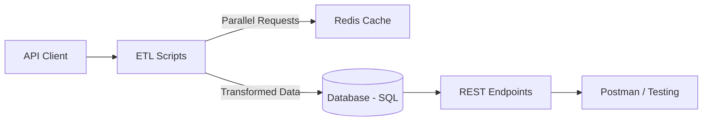

# NebulaBridge: Intergalactic Integration Hub

NebulaBridge is a modern, flexible foundation for system integration and the organization of ETL pipelines, uniting data from various sources (from test APIs to "battle" production endpoints) into one intuitive solution.

---
## See it live 🚀

🔗 **Web UI**: [https://loop.in.net/](https://loop.in.net/) – Log in with the provided credentials.  
🔗 **API Docs**: [https://loop.in.net/api/docs](https://loop.in.net/api/docs) – Test FastAPI endpoints directly in your browser.

## Overview

**Project Objective**  
Create a reliable and scalable platform for data integration and processing that simplifies interactions between various APIs, databases, and services. This platform covers everything from dynamic switching between dev and prod to parallel request processing using caching.

**Key Capabilities**  
- **ETL Pipeline:** Extract data from various APIs, transform it (e.g., by applying special processing modes), and load it into a database via an ORM.
- **API-Oriented Architecture:** Provide an extensible FastAPI-based microservice for data handling and transformation.
- **Flexible Configuration:** Switch between development and production modes via a .env file, with options for caching and special processing modes.

**Why NebulaBridge?**  
1. **Boundless Integration:** Adheres to best practices for combining diverse systems, making it ideal for complex integration tasks.
2. **High Efficiency:** Utilizes Redis for caching, parallel requests, and minimal API calls to significantly accelerate data processing.
3. **User-Friendly Onboarding:** Clear documentation, ready-to-use Postman collections, and a comprehensible code structure help newcomers get started quickly.

---

## Table of Contents

- [Getting Started](#getting-started)
    - [Installation](#installation)
    - [Requirements](#requirements)
    - [Configuration](#configuration)
- [Usage](#usage)
    - [Development Mode](#development-mode)
    - [Production Mode](#production-mode)
    - [Postman Collection](#postman-collection)
- [Core Features](#core-features)
- [Architecture](#architecture)
- [Testing & CI/CD](#testing--cicd)
- [Troubleshooting](#troubleshooting)
- [Contributing](#contributing)
- [License](#license)
- [Conclusion](#conclusion)

---

## Getting Started

### Installation

```bash
# Clone the repository
git clone https://github.com/chernistry/nebula-bridge.git

# Navigate to the project directory
cd nebula-bridge

# Install dependencies
pip install -r requirements.txt
```

### Requirements

- **Python 3.9+** (or the version used in your project)
- **Redis** – optional but recommended for caching requests
- **SQLite / PostgreSQL / MySQL** – depending on your chosen database

### Configuration

1. Copy the example environment file:
    ```bash
    cp .env.example .env
    ```
2. Edit the **.env** file to specify:
    - **API_TOKEN:** Authentication token for the production environment.
    - **USE_PROD:** Set to `true` for production, `false` for development.
    - **REDIS_URL:** URL of your Redis server (if caching is used).
    - **WOOKIE_MODE:** Toggle for special text processing modes.

---

## Usage

### Development Mode

1. Ensure that the flag `USE_PROD=false` is set in the **.env** file to use the test API.
2. Start the server using FastAPI/uvicorn:
    ```bash
    uvicorn app.main:app --reload
    ```
3. Open [http://localhost:8000/docs](http://localhost:8000/docs) to view the interactive Swagger documentation.

### Production Mode

1. Set `USE_PROD=true` and ensure your **API_TOKEN** is correct.
2. Run the main ETL/integration script:
    ```bash
    python -m app.etl
    ```
3. Verify successful data extraction by checking logs or the contents of the `backups/` folder.

### Postman Collection

- A ready-to-import Postman Collection (`Taboola_Task.postman_collection.json`) is included in the repository.
- It contains sample requests for:
    - Extracting vehicle data from the Star Wars universe
    - Searching for characters
    - Calculating team salaries
    - And other integration tasks

> **Tip:** Refer to the script in `app.extract.postman` which generates and validates the JSON collection.

---

## Core Features

| **Feature**                          | **Description**                                                                 | **Technologies**       |
|--------------------------------------|---------------------------------------------------------------------------------|------------------------|
| **API Integration for Dev & Prod**   | Seamless switching between the test API (swapi.dev) and the production API (Workato) | Python, FastAPI        |
| **ETL Pipeline**                     | Complete cycle: extraction, transformation (e.g., applying special modes), and loading | SQLModel, SQLite       |
| **Caching & Parallel Requests**      | Accelerated repeat requests using Redis and asynchronous processing             | Redis, aiohttp         |
| **SQL & Analytics**                  | Hierarchical queries for calculating total team salaries                        | SQL, SQLModel          |
| **OData Integration**                | Minimal number of requests for aggregating flight data                          | OData, requests        |

---

## Architecture



1. **API Client:** Handles environment switching, caching, and parallel requests.
2. **ETL Scripts:** Coordinate the extraction, transformation, and storage of data from external sources.
3. **Database:** Stores processed data such as vehicle and employee information.
4. **REST Endpoints:** Provide data via FastAPI for further integration and debugging.

---

## Testing & CI/CD

- **Testing:**  
    - Unit and integration tests (using Pytest) are located in the `tests/unit` and `tests/integration` directories.
- **Continuous Integration:**  
    - Configurable via GitHub Actions or Jenkins.
    - Typically includes:
        1. Code style checks and unit testing on every commit.
        2. Integration tests using stubs and mocks.
        3. Automated deployment to staging/production environments.

```bash
# Run all tests
pytest --maxfail=1 --disable-warnings -q
```

---

## Troubleshooting

| **Issue**                          | **Possible Causes**                                | **Resolution**                                                 |
|------------------------------------|----------------------------------------------------|----------------------------------------------------------------|
| **Invalid API_TOKEN**              | Typo in the **.env** file or expired token          | Check the **.env** file and request a new token if necessary.  |
| **No Connection to Redis**         | Redis is not running or the URL is incorrect       | Verify the **REDIS_URL** and ensure Redis is active.           |
| **Database Lock/Concurrency Issues** | Too many requests in development mode              | Consider using a more robust database engine.                  |
| **Stale Filter Results**           | Accumulated cache or incorrect USE_PROD flag        | Clear the Redis cache or verify environment settings.          |

For detailed logs, enable debug mode:

```bash
export LOG_LEVEL=DEBUG
```

---

## Contributing

1. **Fork and Create a Branch:**  
    ```bash
    git checkout -b feature/your-awesome-feature
    ```
2. **Commit:** Follow [Conventional Commits](https://www.conventionalcommits.org/) to describe your changes.
3. **Pull Request:** Describe your changes, referencing related tasks and tests.

> **Tip:** Add unit/integration tests for new features to maintain high test coverage.

---

## License

This project is distributed under the MIT License. See the [LICENSE](LICENSE) file for details.

---

## Conclusion

NebulaBridge is a modular, clearly structured solution that supports both sandbox and secure production modes. Its flexible architecture, emphasis on caching and parallel processing, and ready-to-use Postman collections make it a reliable foundation for enterprise-level integration projects.

Adapt the project to suit your needs and let data integration become less chaotic and more stellar!

Good luck with your integrations, and may the data always be with you!
